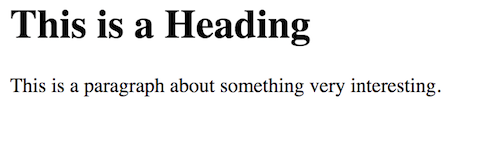
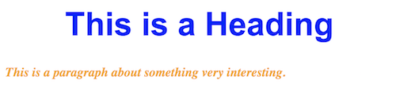
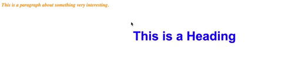
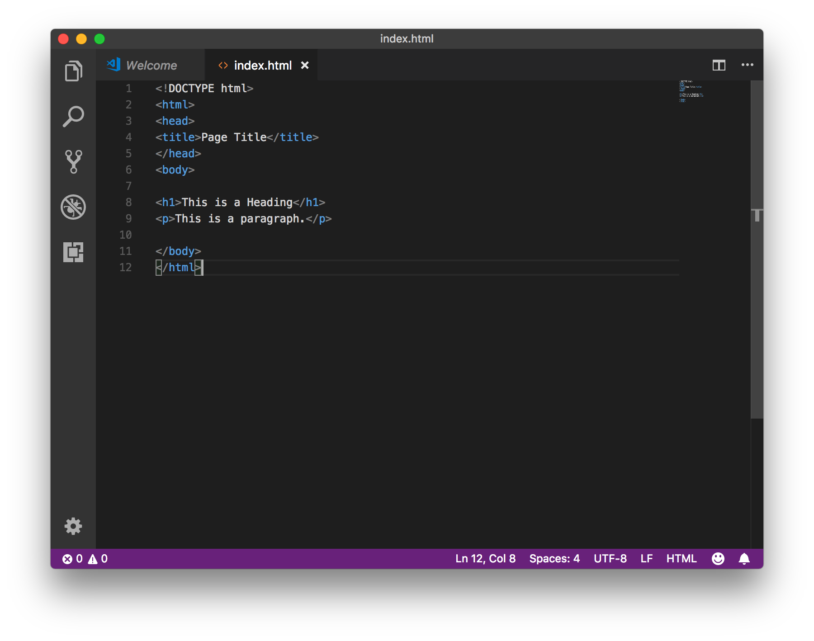
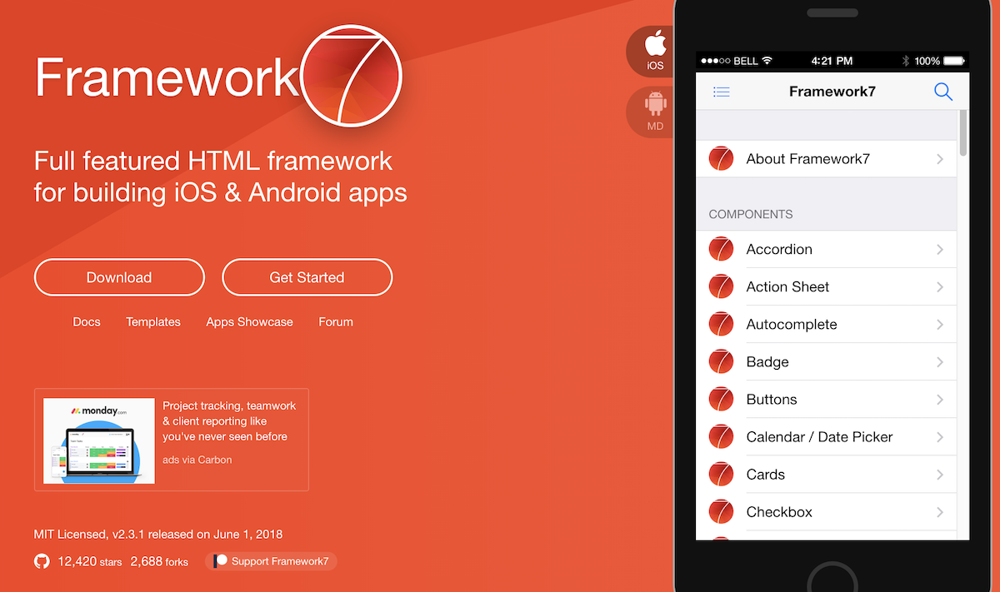
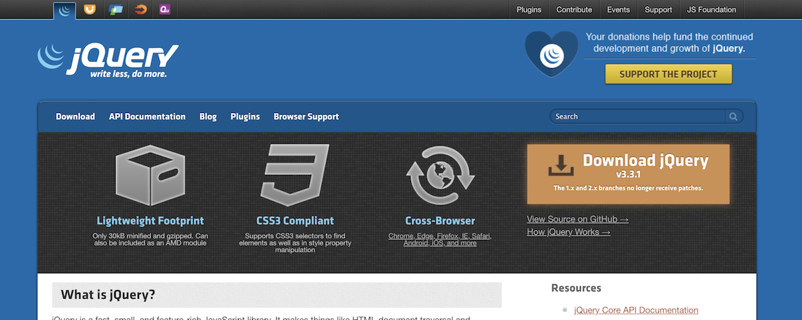
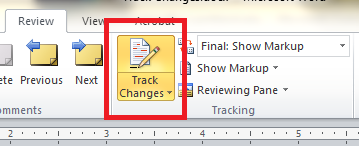

# A Beginner's Launchpad to Web Development

### George Marzloff, MD

---
## Introduction

Welcome to Web Development! It is a fun skill to develop and very manageable to do as a side hobby in your free time. I originally wrote this article to introduce web dev to my colleagues in the medical field who were interested but did not know where to start. This article serves as an orientation into the field, and the real learning is found in the linked tutorials. 

First, you will need to download software and skim through tutorials. As you become comfortable with HTML, CSS, and basic Javascript, you can build web apps using libraries and frameworks that take care of the hard parts of user interface. I will also point to ways you can create public open-source projects and collaborate with others to build software as a team.

## Software
There is a couple of applications you will need to get started, and they are free: 

* **Text Editor**: I recommend [Visual Studio Code](https://code.visualstudio.com/) or [Atom Text Editor](https://atom.io)
* **Web Browser**: [Google Chrome](https://www.google.com/chrome/browser/) or [Apple's Safari](https://support.apple.com/downloads/#safari) will work. Both offer nice developer inspectors to "look under the hood" of websites. 

## An Aerial View


Through this overview, I will cover three fundamental technologies used on the Web: *HTML*, *CSS*, and *Javascript*.

### HTML
HyperText Markup Language, or HTML, is not code, but rather a way to create structure in content that a machine can understand. While a Word document might provide formatting information, it does not necessarily identify the important headings, normal paragraphs, etc. An HTML document looks like the following: 

```
<html>
	<head>
		<title>Title of The Page</title>
	<head>
	<body>
		<h1>This is a Heading</h1>
		<p>This is a paragraph about something very interesting.</p>
	</body>
</html>
```
The text content is structured into different parts called elements. There is no information about what the text should like though. Web browsers have a default basic style to present this HTML. Here is what the above looks like in a browser:

 

### CSS

Cascading Style Sheet, or CSS, is a file type that defines a set of rules for how the content should look. An example file looks like this:

```
 h1 { 
	font-family: Arial;
	color: blue;
	text-align: center;
	font-size: 36pt;
}

p {
	color: orange;
	font-style: italic;
	font-weight: bold;
	font-size: 14pt;
}
```

The `h1` and `p` style rules define how the text within `<h1>` and `<p>` looks in the html. Here is the same html rendered with style:



### Javascript

HTML defines document structure, and CSS defines the look of the content, but there is mostly no ability for interaction (well, CSS has some ways to change styles in response to mouse movements but it is still limited). To create the rich user interfaces and experiences of modern websites, the programming language Javascript is used. All modern browsers support Javascript. Below, I added some Javascript code to tell the browser to make the heading text follow the mouse cursor: 

```
	<body id="body">
		<h1 id="heading">This is a Heading</h1>
        <p>This is a paragraph about something very interesting.</p>
        
        <script language="javascript">
            var heading = document.getElementById("heading");
            var body = document.getElementById("body");
            
            body.addEventListener("pointermove",function(event){
                moveDiv(event);
            });

            function moveDiv(event){
                heading.style.top = event.pageY; // matches the heading top to the cursor's Y
                heading.style.left = event.pageX; // matches the heading left to the cursor's X
            }
        </script>
	</body>
``` 
And the result:

 

This short example offers a sense of what HTML, CSS and Javascript files look like, and now it is time for a more thorough introduction via beginner tutorials.


## HTML, CSS, and Javascript Tutorials
Rather than re-invent the wheel with my own tutorials, I recommend that you follow the great free ones of [W3Schools.org](https://w3schools.org). The following steps describe the general process.

1. Create a folder in My Documents or other central location called `projects`, or any general name you want. You will put directories of projects in here to keep everything organized. 
2. Make a new folder within that called `introduction`. You can use this to work through the tutorials. 
3. Open your text editor (I will use Visual Studio in the screenshots) and use it to follow the tutorials. You could use the "Try it Yourself" buttons in the W3schools tutorials to load a browser code editor in your browser, but it is better to work with your own files that you can save, link with other files (e.g. CSS, Javascript), and become more comfortable with the text editor. 
	1. At the [first tutorial page](https://www.w3schools.com/html/default.asp), type the code in the example in Visual Studio code. 
	2. Save your file as `index.html` in your `projects/introduction/` folder or whatever you named it.
	3. Drag the file into Chrome or Safari, and a new tab should open rendering that file in the browser.
	4. You should see parts of the text such as tag names (e.g. `<head>`) colors change; this is called syntax highlighting and it automatically sets the mode to `html` because the file's extension is `html`. 
	5. Anytime you revise the code, save it (`Cmd+S` for Mac or `Ctrl+S` for Win) in the text editor, then refresh (`F5` or `Ctrl+R` (windows) or `Cmd+R` (mac)) in the browser.



## Take Your Apps to the Next Level using Frameworks and Libraries

Beginner tutorials are important to learn fundamentals, but to code a modern web app from scratch would take a lot of time and effort. Instead of trudging that painstaking pathway, you can use existing software to help you. Today, there are many *libraries* and *frameworks* (for this article, consider them similar to libraries) that you can include in your app to make development much easier. 

### Framework7
To re-create the look of iOS or Android apps, you can use [Framework7](https://framework7.io). 



### jQuery

[jQuery](https://jquery.com) is a Javascript library that simplifies code for tasks such as animation, and manipulating a web document live to change text or adjust CSS styles.



## Version Control using Git

Diving into *Version Control* with Git is something you should probably defer until you are somewhat comfortable with the HTML and CSS tutorials to avoid complicating things. You can read the following introduction about it for a basic understanding of its role in the development process.

*Version Control* is a concept most commonly encountered in the medical research field as Microsoft Word's Track Changes feature. In this workflow, one user can turn on Track Changes, revise the document, and send it back to someone for review. The recipient can accept or reject changes, but once those decisions are made, the edits becomes part of the document and the records of the changes disappear. If a team wants to keep the record of the changes, a common workaround used is to save a copy of the document with the changes tracked permanently. If another user wants to make edits, the user now has to email around the same file with their updated track changes.  



This workflow becomes inefficient and unwieldy quickly. Imagine if a team of software developers used the same system, but instead of a single document among two or three people, there are millions of lines of code being edited by dozens to hundreds of engineers. The "Track Changes" approach is simply untenable.

Fortunately, there are more robust approaches to version control. The most popular version control software these days is called Git. The entire codebase of Microsoft Windows (3.5 million files, 300GB of code!) is maintained with Git and discussed on the [Microsoft Blog](https://blogs.msdn.microsoft.com/bharry/2017/05/24/the-largest-git-repo-on-the-planet/). 

[Github](https://github.com) is a popular platform that maintains software projects using Git and facilitates collaboration among teams. A basic overview article is available on [HowToGeek](https://www.howtogeek.com/180167/htg-explains-what-is-github-and-what-do-geeks-use-it-for/). When building any software project, it is a good idea to use version control by hosting it on GitHub (or [Bitbucket](https://bitbucket.org/), a similar service that offers free private repositories).

There is a good GitHub tutorial in the [GitHub Guides](https://guides.github.com/activities/hello-world/). The easiest way to work with a repository is using software with graphical user interfaces: 

* [GitHub Desktop](https://desktop.github.com/) available for Mac and Windows. 
* [SourceTree](https://www.sourcetreeapp.com/) is another good free software for repository management. 


## Troubleshooting


Finding help for a coding problem is often easy with the large community of software developers that have a created a knowledgebase on the Web. Generally, I search for my issue with Google and find an answer within the first few results. Often the results are from [Stack Overflow](https:://stackoverflow.com),  a forum website for all types of coding languages. 

If your issue is not solved with a quick search, then you could post a question on the StackOverflow forums. [SitePoint](https://www.sitepoint.com/community/c/html-css) offers more forums for HTML, CSS, Javascript, and others.  

And feel free to contact me with questions! [george@marzloffmedia.com](mailto:george@marzloffmedia.com)


### Happy coding!


